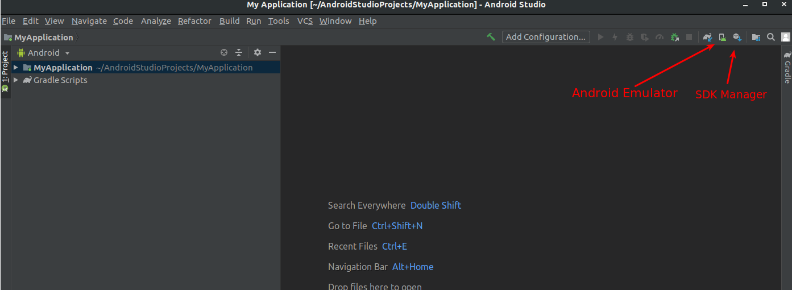

# HOW TO INSTALL ANDROID Studio with android SDK

1. [Download Android Studio](https://developer.android.com/studio)
2. Follow instructions to set your personal preferences
3. Click on the Open Project option in the dialog and navigate to the `Android` folder inside the `marlow-crewcompanion-app` folder and click `open`.
4. Click on the SDK Manager to download the OS to configure your emulator 
5. Select the `Android Q` and click `OK`.
6. Accept every T&C dialog that will be displayed and wait until they are downloaded.
7. Click on the Adroid emulator as shown on the image above.
8. Click on the `Create Virtual Machine` button placed on the left bottom corner of your display.
9. Select the `Pixel 2 XL` device under the `phone` Side-panel and click `Next`.
10. I there is an error on the right hand-side of the screen saying: `/dev/kvm device: Permission denied.` run `sudo chown [USERNAME] /dev/kvm`.
11. Select `Andoid Q` click `Next` and `Finish`.
12. Wait until synchronization is completed and click on the Green play button at the top bar of Adnroid Studio. Select the Pixel 2 XL emulator and click OK.
